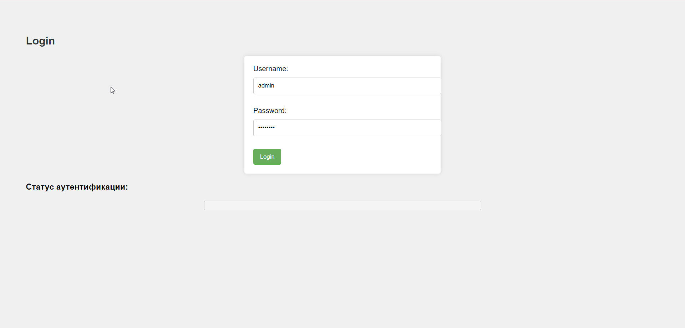
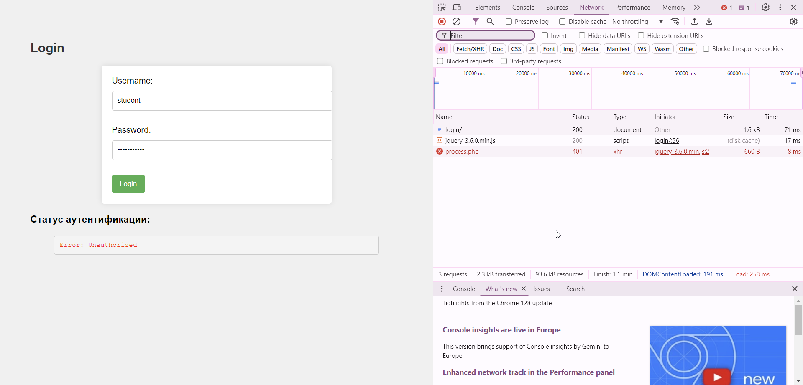
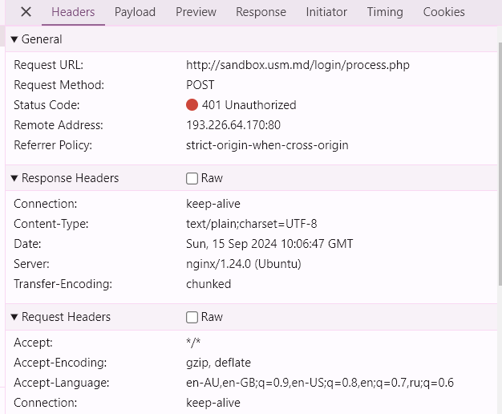
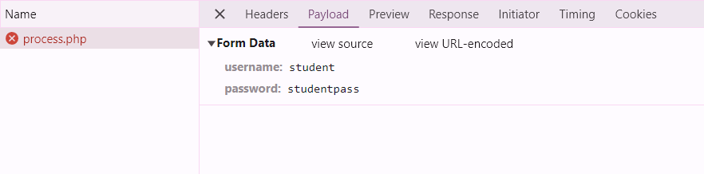
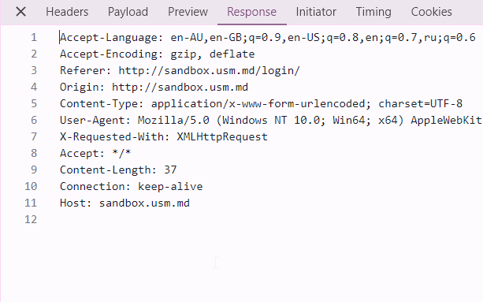
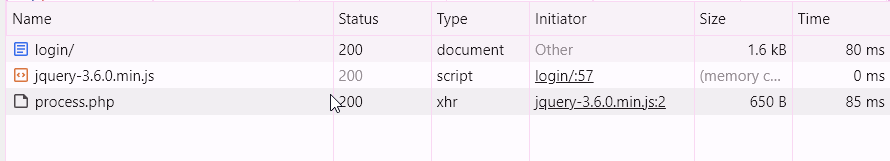
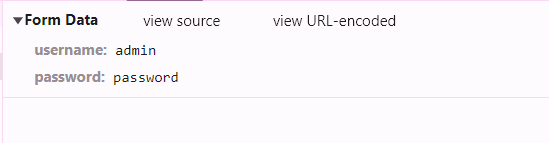
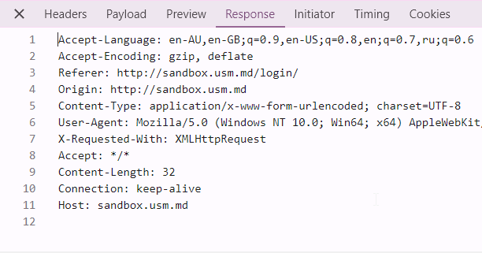
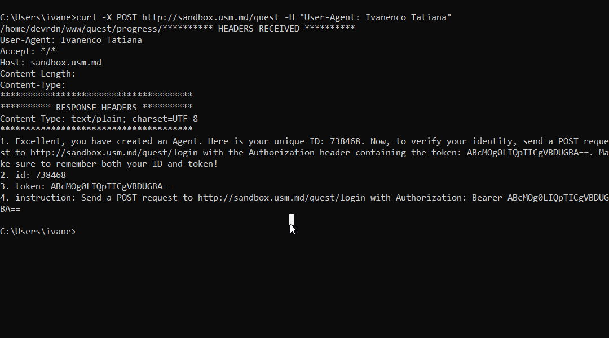
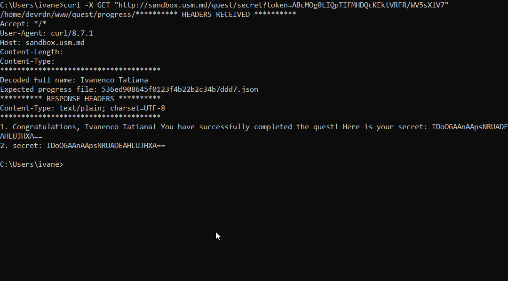

### Содержание

* [Цель лабораторной работы](#цель)
* [Задание №1. Анализ HTTP-запросов](#задание-1-анализ-http-запросов)
* [Задание №2. Составление HTTP-запросов](#задание-2-составление-http-запросов)
* [Задание №3. Дополнительное задание. HTTP_Quest TIP](#задание-3-дополнительное-задание-http_quest-tip)

# Лабораторная работа №1. Основы HTTP
### Цель

Целью данной лабораторной работы является изучение основных принципов протокола HTTP.

## Задание №1. Анализ HTTP-запросов
1. Зайдите на сайт http://sandbox.usm.md/login.



2. Откройте вкладку Network в инструментах разработчика браузера.

3. Введите неверные данные для входа (например, username: student, password: studentpass).

4. Проанализируйте запросы, которые были отправлены на сервер.


5. Ответьте на следующие вопросы:

* Какой метод HTTP был использован для отправки запроса?

Для отправки запроса был использован метод POST

* Какие заголовки были отправлены в запросе?

content-type: 
text/plain;charset=UTF-8

user-agent:
Mozilla/5.0 (Windows NT 10.0; Win64; x64) AppleWebKit/537.36 (KHTML, like Gecko) Chrome/128.0.0.0 Safari/537.36

host:
sandbox.usm.md



* Какие параметры были отправлены в запросе?

были переданы параметры username и password, которые ввел пользователь 



* Какой код состояния был возвращен сервером?

Status Code: 401 Unauthorized, что означает, что данные для входа неверные 

* Какие заголовки были отправлены в ответе?



Accept-Language:
Указывает предпочтительные языки, которые браузер хотел бы видеть в ответе. 

Accept-Encoding:
Информирует сервер о том, какие методы сжатия браузер поддерживает для получения сжатых данных.

Referer:
Указывает URL страницы, откуда был отправлен запрос

Origin:
Указывает исходный URL (сайт), с которого был отправлен запрос

Content-Type:
Указывает тип данных, отправленных в запросе.

User-Agent:
Информация о браузере и операционной системе, с которых был отправлен запрос.

X-Requested-With:
Указывает, что запрос был инициирован через XMLHttpRequest

Accept:
Указывает, какие типы контента может принять браузер. в моём случае все типы контента.

Content-Length:
Указывает длину тела запроса (в байтах). В этом случае — 37 байт.

Connection:
Указывает, что соединение должно оставаться активным, пока сервер не отправит ответ.

Host:
Указывает, к какому хосту (сайту) отправлен запрос.

6. Повторите шаги 3-5, введя верные данные для входа (username: admin, password: password).



* Какой метод HTTP был использован для отправки запроса?

POST

* Какие заголовки были отправлены в запросе?

`user-agent:
Mozilla/5.0 (Windows NT 10.0; Win64; x64) AppleWebKit/537.36 (KHTML, like Gecko) Chrome/128.0.0.0 Safari/537.36`

`equest Method:
POST`

`Status Code:
200 OK`

* Какие параметры были отправлены в запросе?



* Какой код состояния был возвращен сервером?

`200 ok`,  что означает, что пользователь успешно зашёл в систему 

* Какие заголовки были отправлены в ответе?




##  Задание №2. Составление HTTP-запросов

1. Составьте GET-запрос к серверу по адресу http://sandbox.com, указав в заголовке User-Agent ваше имя и фамилию.

`GET / HTTP/1.1
Host: sandbox.com
User-Agent: Tatiana Ivanenco`

2. Составьте POST-запрос к серверу по адресу http://sandbox.com/cars, указав в теле запроса следующие параметры:
* make: Toyota
* model: Corolla
* year: 2020

`POST /cars HTTP/1.1
Host: sandbox.com
Content-Type: application/x-www-form-urlencoded
User-Agent: Tatiana Ivanenco`

`make=Toyota&model=Corolla&year=2020`


3. Составьте PUT-запрос к серверу по адресу http://sandbox.com/cars/1, указав в заголовке User-Agent ваше имя и фамилию, в заголовке Content-Type значение application/json и в теле запроса следующие параметры: json { "make": "Toyota", "model": "Corolla", "year": 2021 }

```
PUT /cars/1 HTTP/1.1
Host: sandbox.com
Content-Type: application/json
User-Agent: Tatiana Ivanenco

{
  "make": "Toyota",
  "model": "Corolla",
  "year": 2021
}
```

4. Напишите один из возможных вариантов ответа сервера следующий запрос. http POST /cars HTTP/1.1 Host: sandbox.com Content-Type: application/json User-Agent: John Doe model=Corolla&make=Toyota&year=2020 Предположите ситуации, когда сервер может вернуть HTTP-коды состояния 200, 201, 400, 401, 403, 404, 500.
```
POST /cars HTTP/1.1
Host: sandbox.com
Content-Type: application/json
User-Agent: John Doe
model=Corolla&make=Toyota&year=2020
```

1. `200 OK`
Сервер успешно обработал запрос. 

2. `201 Created`
Сервер успешно создал новый ресурс.

3. `400 Bad Request`
Сервер не может обработать запрос из-за ошибки в синтаксисе запроса. 

4. `401 Unauthorized`
Сервер требует аутентификацию, но не получил её, либо аутентификация была неверной.

5. `403 Forbidden`
Сервер понял запрос, но отказывает в его выполнении. Это может произойти, если пользователь не имеет прав доступа к определённому ресурсу.

6. `404 Not Found`
Сервер не может найти запрашиваемый ресурс.

7. `500 Internal Server Error`
Общая ошибка сервера, возникающая, когда что-то пошло не так на стороне сервера


## Задание №3. Дополнительное задание. HTTP_Quest TIP
1. Отправьте POST-запрос на сервер по адресу http://sandbox.usm.md/quest, указав в заголовке User-Agent вашу фамилию и имя (Например User-Agent: John Doe).
POST /quest HTTP/1.1
Host: sandbox.usm.md
User-Agent: John Doe
curl:


curl -X POST http://sandbox.usm.md/quest -H "User-Agent: Ivanenco Tatiana" 



2. Следуйте инструкциям на сервере, выполняя их по порядку.



3. В конце квеста Вам будет показано секретное слово, которое Вы должны будете предоставить в отчете.
Примечание к заданию 3:

 secret: IDoOGAAnAApsNRUADEAHLUJHXA==

1. Используйте инструмент curl, postman или любой другой инструмент для отправки запросов.
2. Вы можете начинать квест заново, выполнив первый шаг.